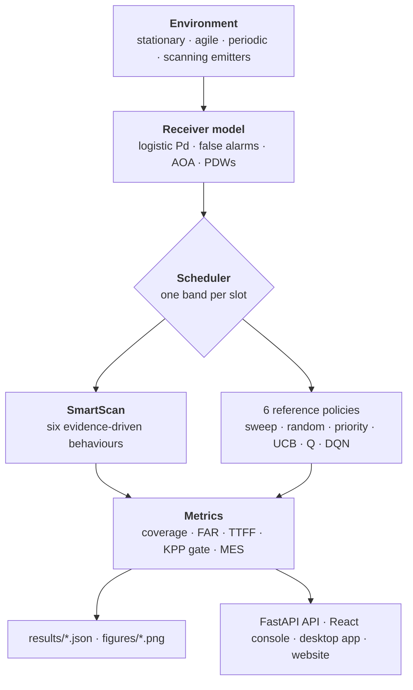
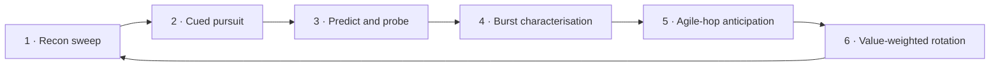
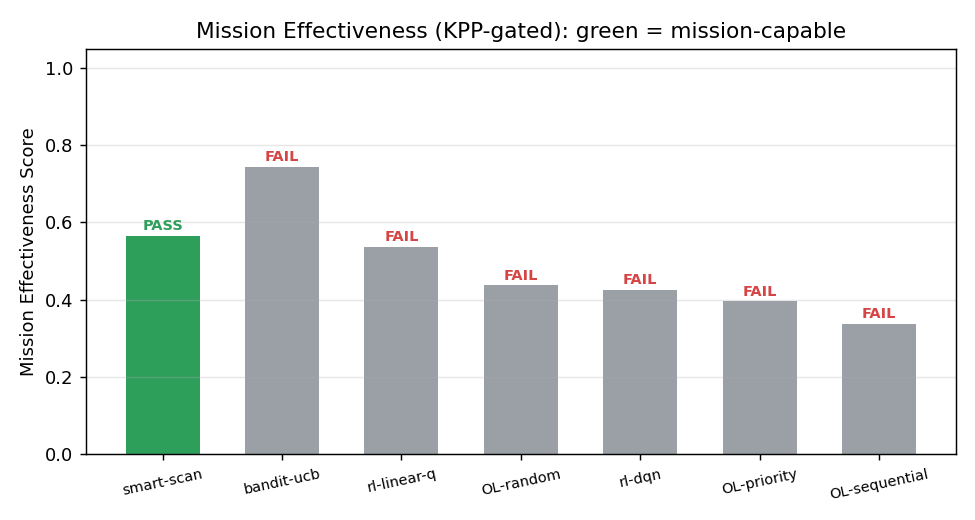
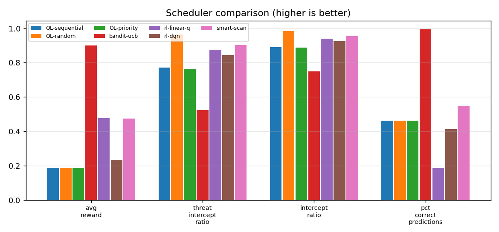
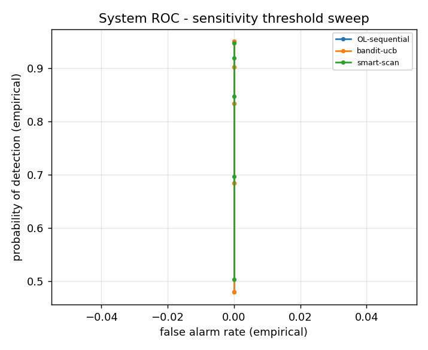
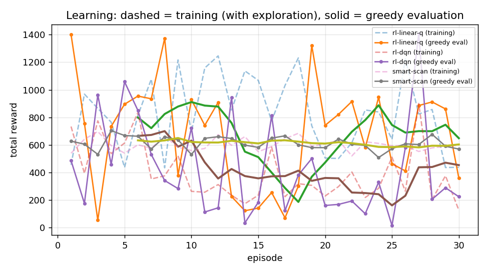
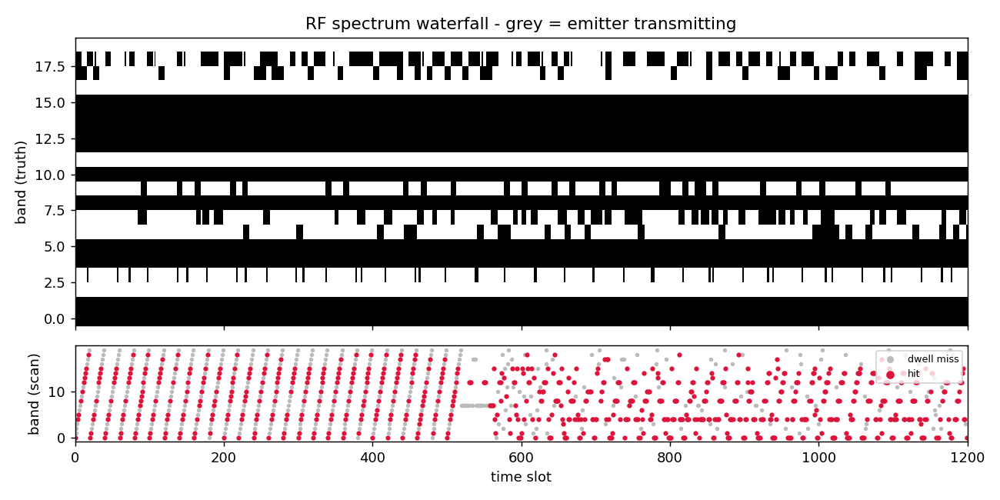
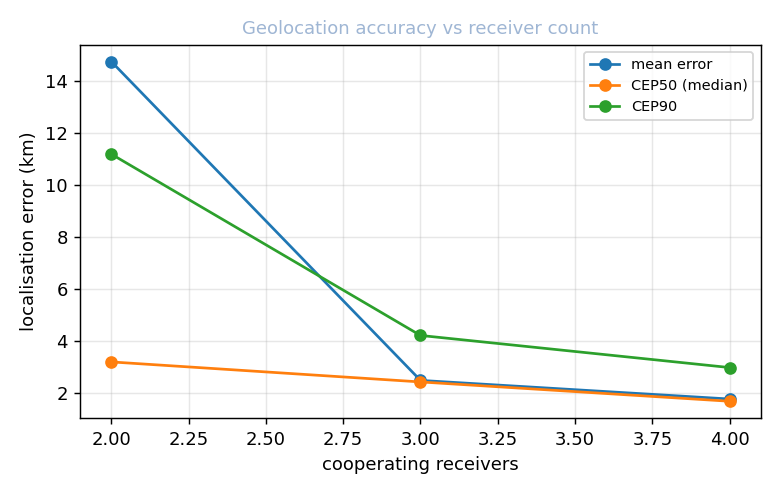

<p align="center">
  
</p>

<h1 align="center">ASTRA</h1>
<h3 align="center">Adaptive Spectrum Threat Recognition &amp; Analysis</h3>

<p align="center">
  <em>Smart Scan scheduling for Electronic Support receivers — a simulated,
  multi-policy research testbed built for the Smart India Hackathon 2026 problem
  statement “Development of a Smart Scan Strategy for Electronic Warfare”.</em>
</p>

<p align="center">
  
  
  
  
  
  
</p>

<p align="center">
  <a href="#quick-start">Quick start</a> ·
  <a href="#how-it-works">How it works</a> ·
  <a href="#results">Results</a> ·
  <a href="#interfaces">Interfaces</a> ·
  <a href="#testing">Testing</a> ·
  <a href="#documentation">Docs</a>
</p>

---

> **Scope.** Simulation-based research software built for a hackathon
> submission. Emitters, propagation, detection and false alarms are modelled in
> software — there is no recorded RF data, no radar hardware, no classified
> material, and nothing here is operational equipment.

## What this is

ASTRA schedules the dwells of an Electronic Support (ES) receiver. Such a
receiver can listen to one narrow band at a time, so at every time slot a policy
chooses a band, the receiver observes a hit, a miss or a false alarm, and the
policy updates. The task is to intercept as many emitters as possible, as early
as possible, without knowing their frequencies in advance.

`SmartScan` — the policy developed here — combines online lock validation, a
learned agile-hop transition model and SNR+AOA fingerprinting, and is evaluated
against six reference schedulers under one common protocol.

| | |
|---|---|
| **Schedulers** | SmartScan + 6 reference policies (sequential, random, priority, UCB bandit, linear Q-learning, DQN) |
| **Protocol** | 24 bands × 3000 slots × 50 episodes, `base_seed=9000`, identical for every policy |
| **Gate** | Hard KPP thresholds first, composite mission-effectiveness ranking second |
| **Winner** | SmartScan — the only policy clearing every gate (coverage 0.903, prediction accuracy 0.548) |
| **Interfaces** | FastAPI service, React command centre, Qt desktop app, Windows installer, presentation site |
| **Tests** | 306 pytest tests (`python -m pytest tests -q`) |

### Repository contents

| Path | Contents |
|---|---|
| `ewsmart/` | RF environment, receiver physics (detection, AOA, PDWs), seven schedulers, metrics, multi-receiver coordination, identification, geolocation, experiment harness |
| `server/` | FastAPI service: benchmarks, figures, manual, live A/B arena, source management |
| `frontend/` | React command centre (Home, Operations, Analysis, Intelligence, Data Sources, Geolocation) |
| `desktop_qt.py`, `desktop.py` | Desktop application (Qt WebEngine window, or a browser window fallback) |
| `website/` | Presentation site (Vite), pre-built bundle committed in `website/dist` for Vercel |
| `docs/` | Documentation site and the full software manual |
| `tests/` | 306 pytest tests |

---

## Quick start

```powershell
git clone https://github.com/RARPlayzDev/Astra.git
cd Astra
python -m pip install -e ".[dev]"

# one episode with every scheduler → results.json and models/*.npz
python -m ewsmart.runner --scenario scenarios/demo.json --save-dir models --json-out results.json

# the full Monte Carlo suite → results/*.json and figures/*.png
python -m ewsmart.experiments --suite full

# verify everything
python -m pytest tests -q
```

`ewsmart-run` and `ewsmart-experiments` are the same entry points as console
scripts. Two scenarios ship with the repository — `scenarios/demo.json` and
`scenarios/dense_low_snr.json`; further configurations are produced by
`ewsmart.config`. Use `--suite quick` for a fast pass.

### Requirements

| Dependency | Needed for |
|---|---|
| Python ≥ 3.10 | everything |
| Node.js ≥ 18 | building `frontend/` and `website/` |
| PyInstaller | rebuilding the desktop bundle `dist/ASTRA/` |
| Inno Setup 6 (`ISCC.exe`) | rebuilding `installer/*.exe` |

The base install is `numpy`, `fastapi`, `uvicorn`, `markdown` and `matplotlib`
(the last is imported by `ewsmart/viz.py` and `ewsmart/experiments.py`). `[dev]`
adds `pytest` and `pytest-cov`; the optional `[hf]` extra adds `datasets` for the
HuggingFace calibration path in `ewsmart/dataset.py`.

---

## How it works

The receiver can only dwell in one band per slot, so the problem is a sequential
decision under uncertainty: which band most likely contains undiscovered or
time-critical emitters *right now*.



### The six SmartScan behaviours

| # | Behaviour | Active when | Mitigates |
|---|---|---|---|
| 1 | Recon sweep | episode start / little evidence | acting on no information |
| 2 | Cued pursuit | validated phase locks exist | missing predictable targets |
| 3 | Predict & probe | candidate rhythm, unproven | never testing a hypothesis |
| 4 | Burst characterisation | isolated hit on a quiet fingerprint | under-sampling rare emitters |
| 5 | Agile-hop anticipation | frequent hops on a tracked stream | losing agile emitters between hops |
| 6 | Value-weighted rotation | always (fallback) | band starvation |



Mechanisms behind the behaviours: online lock validation (predictions must keep
coming true, stale locks are dropped), SNR+AOA fingerprinting so co-channel
emitters stay apart, a per-stream transition model for agile hops learned only
from observed detections, and one-slot falsification of wrong hypotheses.

---

## Results

Every number below is written by `python -m ewsmart.experiments --suite full` into
`results/` (generated, not committed). The canonical protocol
(`ewsmart.experiments.CANONICAL_PROTOCOL`) is **24 bands × 3000 slots × 50
episodes, `base_seed=9000`**, identical for every scheduler.

<p align="center">
  
  
</p>

<p align="center"><sub>
  KPP-gated Mission Effectiveness (left) and the underlying per-metric comparison
  (right). Both are produced by <code>ewsmart/viz.py</code> during the suite run.
</sub></p>

### Monte Carlo evaluation — `results/benchmark.json`

Mean ± 95% CI across 50 episodes
(`python -c "from ewsmart.experiments import benchmark_report; benchmark_report()"`):

| Scheduler | Avg Reward | Threat Coverage | Pred Accuracy | Mission Capable? |
|---|---|---|---|---|
| Sequential Sweep | 0.186 ± 0.004 | 0.775 ± 0.024 | 0.461 | ❌ |
| Random Scan | 0.188 ± 0.005 | 0.975 ± 0.012 | 0.460 | ❌ |
| Priority Sweep | 0.186 ± 0.004 | 0.765 ± 0.027 | 0.461 | ❌ |
| UCB Bandit | 0.900 ± 0.013 | 0.527 ± 0.026 | 0.995 | ❌ (coverage gate) |
| Linear Q-Learning | 0.449 ± 0.048 | 0.880 ± 0.029 | 0.184 | ❌ |
| Deep Q-Network | 0.200 ± 0.031 | 0.887 ± 0.024 | 0.426 | ❌ |
| **SmartScan** | **0.471 ± 0.014** | **0.920 ± 0.016** | **0.545** | **✅** |

The same artifact reports the full figure-of-merit set (intercept rate,
false-alarm rate, time-to-first-intercept, intercept-time prediction error,
ambiguous co-channel hit rate), per-scheduler agile-hop follow rates, the
observation-only next-hop prediction benchmark and attribution-conservation
checks.

### Mission effectiveness (KPP-gated) — `results/suite_results.json`

Hard Key Performance Parameters gate first, composite ranking second:

| KPP gate | Threshold | SmartScan |
|---|---|---|
| Threat coverage | ≥ 0.90 | 0.903 |
| Prediction accuracy | ≥ 0.50 | 0.548 |
| False-alarm rate | ≤ 5·10⁻⁴ /slot | 3.3·10⁻⁵ |
| Mission status | | **CAPABLE — rank 1 (MES 0.619)** |

SmartScan is the only scheduler that clears every gate; on the gated Mission
Effectiveness Score it leads every comparator at p ≤ 1e-4 (paired permutation,
Holm-corrected).

### Supporting measurements

| Measurement | Result | Source |
|---|---|---|
| Reward vs sequential scan | 2.5× (0.471 vs 0.186), +14 pts threat coverage | `results/benchmark.json` |
| Multi-receiver scaling (1 → 2 → 3) | reward 663 → 1192 → 1808 (sequential 365 → 720 → 1067), coverage integrity 1.0, no duplicate dwells | `results/*.json` |
| Geolocation CEP50 (2 → 4 receivers) | 3.2 km → 1.69 km | `figures/geo_cep.png` |
| Identification | 86% (14/19 streams) on the reference episode's built-in library | `results/*.json` |
| Decision latency (Windows 11 / AMD Ryzen) | mean 0.35 ms SmartScan, 0.47 ms DQN vs a 1 ms limit; p95 ≈ 1.2 ms — the tail is recorded, not hidden | `results/performance.json` |

### Agile-hop prediction vs coverage

- Observation-only next-hop prediction (Markov/structured agility): transition
  model **top-1 0.394 / top-3 0.740** (missed-opportunity 0.260) against 0.063
  top-1 for a uniform guesser. Random-mode agility figures are in the artifact.
- Policy-level hop coverage is measured post hoc for *every* scheduler as the
  fraction of agile hops whose destination band was dwelt within 8 slots (table
  in `results/benchmark.md`).

<details>
<summary><b>Figure gallery</b> — generated by the suite, committed under <code>figures/</code></summary>

<br />

| Figure | What it shows |
|---|---|
| [`figures/roc.png`](figures/roc.png) | System ROC — sensitivity threshold sweep |
| [`figures/learning_curves.png`](figures/learning_curves.png) | Learning curves (dashed = training with exploration) |
| [`figures/waterfall.png`](figures/waterfall.png) | RF spectrum waterfall — grey marks an emitting emitter |
| [`figures/geo_map.png`](figures/geo_map.png) · [`figures/geo_cep.png`](figures/geo_cep.png) | Geolocation map and accuracy vs receiver count |
| [`figures/sens_snr.png`](figures/sens_snr.png) · [`figures/sens_bands.png`](figures/sens_bands.png) | Sensitivity to SNR and band count |
| [`figures/sens_density.png`](figures/sens_density.png) · [`figures/sens_agility.png`](figures/sens_agility.png) | Sensitivity to emitter density and agility |
| [`figures/ablation.png`](figures/ablation.png) | Behaviour-ablation study |

<p align="center">
  
  
</p>

<p align="center">
  
  
</p>

</details>

---

## Interfaces

### Web console and API

```powershell
cd frontend; npm install; npm run build; cd ..
python -m uvicorn server.api:app --port 8000
# http://localhost:8000 — OpenAPI schema at /api-docs
```

### Desktop application

```powershell
python desktop_qt.py     # Qt WebEngine window with a system-tray icon
python desktop.py        # serves the same app and opens the default browser
```

`START.bat` and `launch.ps1` are one-click launchers for the same thing.

### Windows installer

`installer/astra_installer.iss` (Inno Setup) packages the PyInstaller output from
`dist/ASTRA/`; build that first with `tools\build_exe.ps1`.

The installer itself is **not stored in the repository** — `*.exe` is ignored and
release binaries live on the GitHub releases page. The 3.0.0 build is
`ASTRA-Setup-3.0.0.exe`, 164,456,208 bytes, SHA-256
`139BFAE2271A1DBB5DC789FCF1698B54AB241F307C868A055B484EAE18DFA362`. It is **not
code-signed**, so Windows SmartScreen warns on first launch; sign it with your own
certificate before distributing.

### Docker (optional)

```powershell
docker build -t astra .
docker run -p 8000:8000 astra
```

The Dockerfile builds the frontend in a Node stage, then serves the API and the
built SPA from a Python image. It is a convenience environment — the desktop
application and the installer are the primary deliverables.

`results/` and `figures/` are git-ignored build products, so the image starts
without them (the API reports an empty benchmark/figures payload). Mount a local
run of the experiment suite to serve the published numbers instead:

```powershell
docker run -p 8000:8000 -v "${PWD}/results:/app/results" -v "${PWD}/figures:/app/figures" astra
```

### Live PDW ingestion

`tools/sdr_bridge.py` bridges a sensor or a file feed into the live pipeline:

```powershell
python tools/sdr_bridge.py --mode csv --csv sweep.csv --out-port 5555
python tools/sdr_bridge.py --mode udp --in-port 5000  --out-port 5555
```

Then select the UDP bridge as the data source in the app. PDW schema:
`toa_us, freq_mhz, pw_us, pa_db, aoa_deg`. The bridge transports whatever the
sensor emits; the calibration and detection models shipped here are simulated.

### Presentation website

```powershell
python tools/export_site_data.py      # bake results/figures/manual into website/
cd website; npm run check             # docs:check · smoke · build · verify:dist
npm run build                         # static output in website/dist
cd ..; powershell -File deploy.ps1    # build + vercel --prod + route check
```

The root [`vercel.json`](vercel.json) publishes the committed `website/dist` with
no build step (`outputDirectory: website/dist`), which is why the bundle is
tracked.

<details>
<summary><b>Deployment notes</b> (Vercel project settings, 404 recovery)</summary>

<br />

- **Root Directory** must stay at the repository root so the root `vercel.json` is
  read. Do not point it at `website`.
- `website/vercel.json` only adds clean URLs for a standalone/root-domain deploy.
- `deploy.ps1` rebuilds, deploys to production, then HTTP-checks the live routes.
- Run `npm run check` before deploying: it runs the manual-section check, the
  server-render smoke test, the production build and the dist-bundle verification
  in sequence.
- If `https://astra-ew.vercel.app/` answers `404 DEPLOYMENT_NOT_FOUND`, the Vercel
  project or its deployment was removed — the code is unaffected. Run
  `npx vercel login`, `npx vercel link` (project `astra-ew`) and
  `powershell -File deploy.ps1` to republish.

</details>


---

## Testing

```powershell
python -m pytest tests -q        # 306 tests
```

The suite splits into two tiers:

| Tier | Count | Determines |
|---|---|---|
| Deterministic tests | 297 | pass/fail on any machine (physics, metrics, API, artifacts, schemas) |
| Wall-clock latency gate (`tests/test_performance.py`) | 9 | mean < 1 ms per scheduler decision — a **host** measurement |

`test_performance.py` asserts a mean of under 1 ms per scheduler decision (best of
three identical passes, plus one documented retry). It therefore measures the host
as much as the code — run it on an otherwise idle machine, and read
`results/performance.json`, which stamps the platform the numbers came from.

| File | Scope |
|---|---|
| `test_smartscan.py` | SmartScan scheduler end to end |
| `test_schedulers_edge.py` | boundary behaviour of all seven policies |
| `test_modules.py` | environment, receiver, estimators, persistence, plots |
| `test_mission.py` | KPP / MES scoring engine |
| `test_api.py` | FastAPI endpoints and the live arena |
| `test_id_geo_stats.py` | identification, geolocation, statistical tests |
| `test_software.py` | JSON safety, model artifacts, engineering guarantees |
| `test_target99_gaps.py` | attribution, agile-hop prediction, canonical artifact |
| `test_experiments_viz.py` | experiment harness and figure generation |
| `test_fidelity_upgrades.py` | simulation-fidelity changes |
| `test_geo_ml.py` | geolocation and ML components |
| `test_live.py` | live streaming, UDP round trip |
| `test_performance.py` | decision-latency budget |
| `test_ps_gaps.py` | problem-statement coverage gaps |
| `test_repair_bundle.py` | regression bundle |
| `test_result_schema.py` | result-artifact schema |

### Engineering notes

- **JSON everywhere** — `json_safe()` strips NaN/Inf, so artifacts parse with strict parsers.
- **Safe model artifacts** — npz + JSON metadata, loaded with `allow_pickle=False`.
- **Independent receiver noise** — every platform realises its own noise floor.
- **Seed-exact reproducibility** — a scenario is a seed plus a JSON config; see [`docs/reproducibility.md`](docs/reproducibility.md).
- **Runtime dependencies** — `numpy`, `fastapi`, `uvicorn`, `markdown` and `matplotlib` (the last only for figure generation).

---

## Repository layout

<details>
<summary><b>Full tree</b> — core library, services and build files</summary>

<br />

```
Astra/
├─ ewsmart/                    # core library
│  ├─ config.py                # scenario configuration (JSON round-trip)
│  ├─ environment.py           # RF environment + emitter truth
│  ├─ receiver.py              # detection physics, false alarms, AOA, PDWs
│  ├─ aoa.py                   # AOA measurement maths
│  ├─ deinterleave.py          # PDW deinterleaving, matched-filter gain
│  ├─ schedulers.py            # SmartScan + 6 reference policies
│  ├─ prediction.py            # agile-hop transition model
│  ├─ periodic.py              # period estimation
│  ├─ dqn.py                   # DQN agent (NumPy)
│  ├─ metrics.py               # figures of merit + KPP-gated MES
│  ├─ multireceiver.py         # cooperative teams, de-confliction
│  ├─ identification.py        # emitter ID library matching
│  ├─ geo.py                   # AOA triangulation, CEP statistics
│  ├─ experiments.py           # canonical suite, ROC, sensitivity, ablation
│  ├─ runner.py                # episode runner + CLI
│  ├─ persistence.py           # npz + JSON artifacts (allow_pickle=False)
│  ├─ live.py, realtime.py     # ingestion pipelines
│  ├─ dataset.py, calibration.py
│  ├─ db.py                    # SQLite trace store
│  ├─ viz.py                   # matplotlib figure generation
│  └─ meta.py, sigtests.py, frontend.py, exceptions.py
├─ server/                     # api.py, livesim.py, sources.py
├─ frontend/                   # React command centre
├─ website/                    # presentation site (dist/ committed for Vercel)
├─ desktop_qt.py, desktop.py   # desktop application entry points
├─ scenarios/                  # demo.json, dense_low_snr.json
├─ models/                     # trained weights (*.npz, git-ignored)
├─ results/                    # generated artifacts (git-ignored, schema tracked)
├─ figures/                    # generated plots (committed)
├─ tests/                      # 306 tests
├─ tools/                      # build and export utilities
├─ docs/                       # documentation site + software manual
├─ installer/                  # astra_installer.iss (Inno Setup)
├─ assets/                     # brand assets
├─ Dockerfile, vercel.json, deploy.ps1, START.bat, launch.ps1
└─ pyproject.toml, requirements.txt, LICENSE
```

</details>

---

## Documentation

| Document | Contents |
|---|---|
| [`docs/ASTRA_Software_Documentation.md`](docs/ASTRA_Software_Documentation.md) | the software manual — served by the app at `/manual` and rendered by the website |
| [`docs/`](docs/) | documentation site: concepts, guides, integration, reference, tutorials |
| [`HOW_TO_TEST.md`](HOW_TO_TEST.md) | step-by-step verification ladder |
| [`docs/reproducibility.md`](docs/reproducibility.md) | how the published numbers are reproduced |
| [`docs/changelog.md`](docs/changelog.md) | change log |

---

## Known limitations

- **Simulation only.** No recorded RF and no hardware-in-the-loop measurements.
  Agility is synthetic (random or Markov), and the agile-hop follow-rate gain over
  a blind sweep is modest.
- **Identification** is library matching against synthetic signatures, not
  identification of recorded emitters.
- **Latency** was measured on one Windows 11 / AMD Ryzen machine; the p95 tail is
  roughly 3× the mean.
- **The installer is unsigned**, and the desktop bundle in `dist/ASTRA/` is a local
  build product rather than a repository artifact.
- **Docker** is provided as a convenience environment and was not rebuilt during
  the last verification pass.

---

## Contributing

1. Fork the repository and create a branch (`git checkout -b feature/name`).
2. Keep `python -m pytest tests -q` green, and run `cd website; npm run check` if
   you touched the site.
3. Open a pull request describing the change and the evidence behind it.

---

## License

MIT — see [`LICENSE`](LICENSE).

<p align="center"><sub>
ASTRA 3.0.0 · prototype developed for the Smart India Hackathon 2026 problem
statement <em>“Development of a Smart Scan Strategy for Electronic Warfare”</em>.<br />
Simulation-based research software — not operational equipment.
</sub></p>

