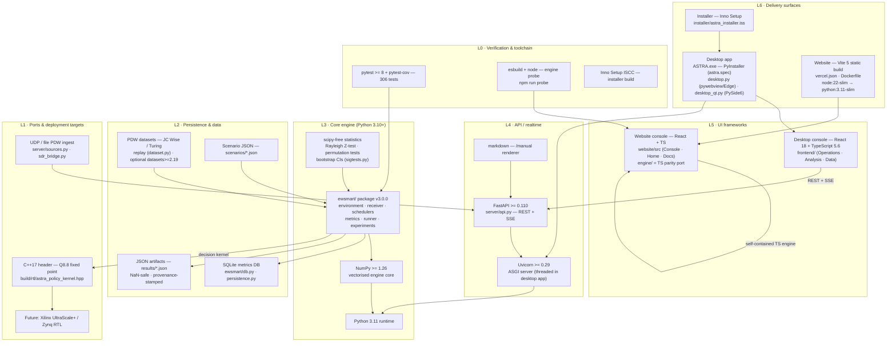
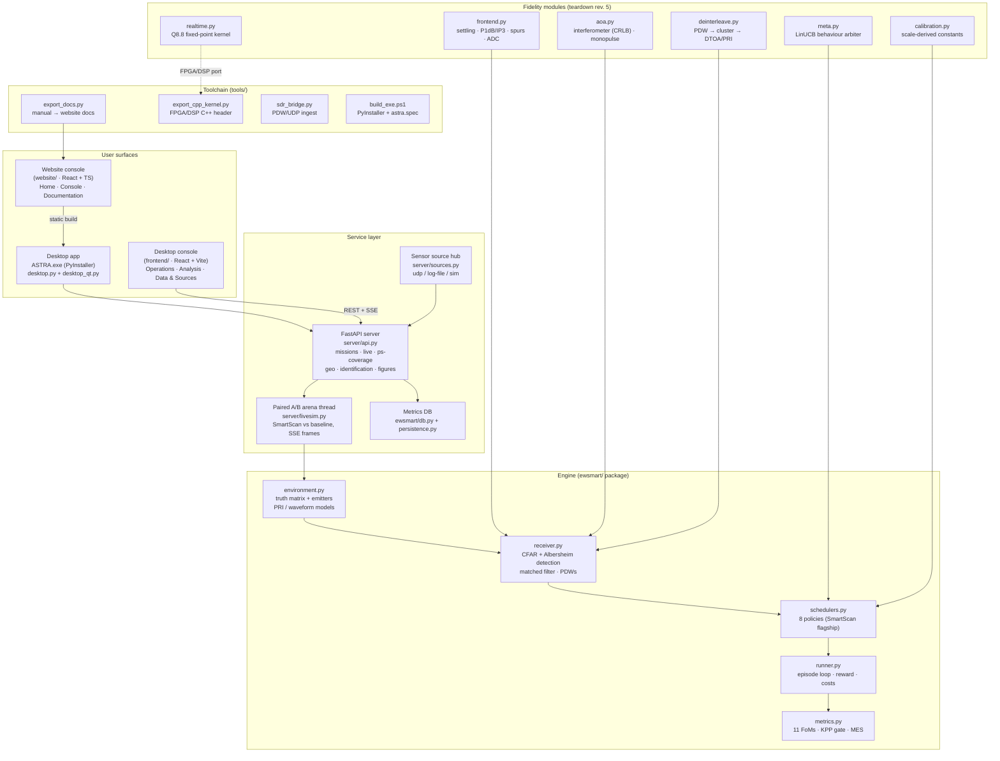
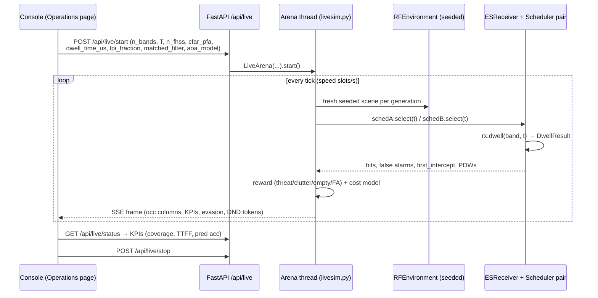
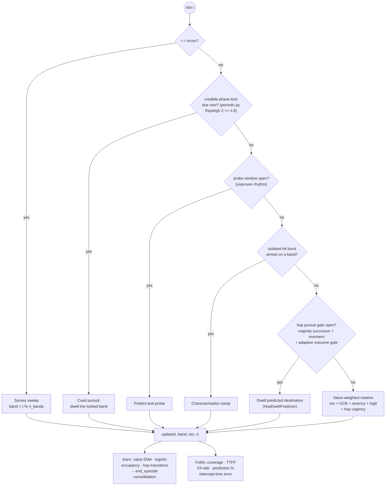
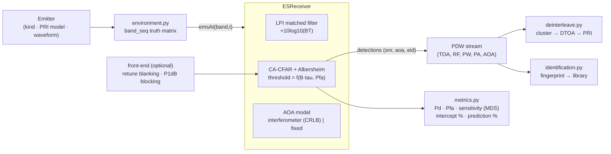
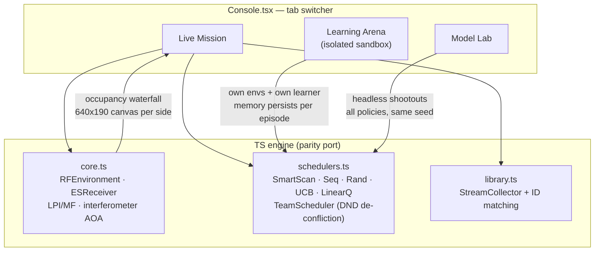
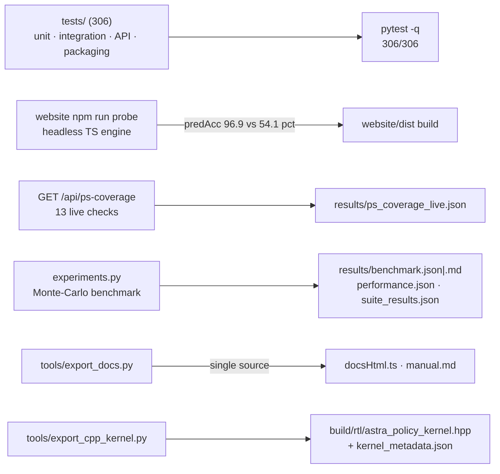
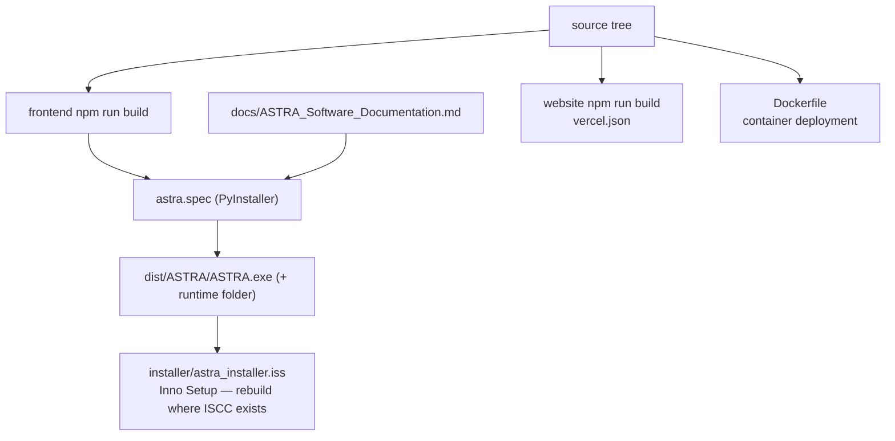

# ASTRA — Architecture Diagrams

Canonical architecture views for the ASTRA Cognitive ES Smart Scan system.
Every box below maps to a real module in this repository (paths in brackets).
Rendered best in any Markdown viewer with Mermaid support (GitHub, VS Code).

---

## 0. Full technology stack (layer cake)

One diagram covering every technology in the system, bottom to top —
hardware/runtime up to the user. Versions match `requirements.txt`,
`pyproject.toml`, `frontend/package.json` and `website/package.json`.

Stack summary table:

| Layer | Technology | Where |
|---|---|---|
| L6 delivery | PyInstaller exe · Vite static site · Inno installer · Docker | `astra.spec`, `vercel.json`, `Dockerfile`, `installer/` |
| L5 UI | React 18 · TypeScript 5.6 · Vite 5 | `frontend/`, `website/` |
| L4 API | FastAPI ≥0.110 · Uvicorn ≥0.29 · markdown · SSE | `server/api.py` |
| L3 engine | Python ≥3.10 · NumPy ≥1.26 | `ewsmart/` |
| L2 data | SQLite · strict JSON · PDW datasets · scenario JSON | `ewsmart/db.py`, `results/`, `scenarios/` |
| L1 ports | UDP/file PDW · C++17 fixed-point header (→ FPGA) | `server/sources.py`, `build/rtl/` |
| L0 verify | pytest ≥8 · esbuild probe · ISCC | `tests/`, `website/scripts/` |

---

## 1. High-level system architecture

---

## 2. Live mission data flow (desktop paired A/B arena)

**Two receivers, byte-identical battlefields** — the seed is identical, so any
performance difference is attributable to the scheduling policy alone.

---

## 3. SmartScan decision pipeline (per slot)

Safety gates on the pursuit path (all measured, all ablatable): majority
successor ≥ 50 %, dwell statistics mature, predicted window imminent (±2
slots), target band not already covered, adaptive success-rate gate, survey
phase gate, rolling budget, and per-stream miss blocking.

---

## 4. Receiver detection chain

---

## 5. Website console — three-bay command centre (rev 3)

Tab isolation contract: the Learning Arena owns its `SmartScanScheduler`
instance, its own `RFEnvironment` per episode, and its cross-episode memory.
The Live Mission tab is untouched by arena runs; wiping arena memory never
affects a running mission.

---

## 6. Verification & evidence flow

---

## 7. Deployment & packaging

---

### Reading order for reviewers
0. Diagram 0 (stack cake) — every technology on one page; the "cover both in one" view.
1. Diagram 1 (system) — what exists.
2. Diagram 2 (live flow) — how it runs in front of a jury.
3. Diagram 3 (SmartScan pipeline) — where the intelligence is.
4. Diagram 4 (receiver chain) — why the FoMs are physically coupled.
5. Diagrams 5–7 — the browser port, verification, packaging.